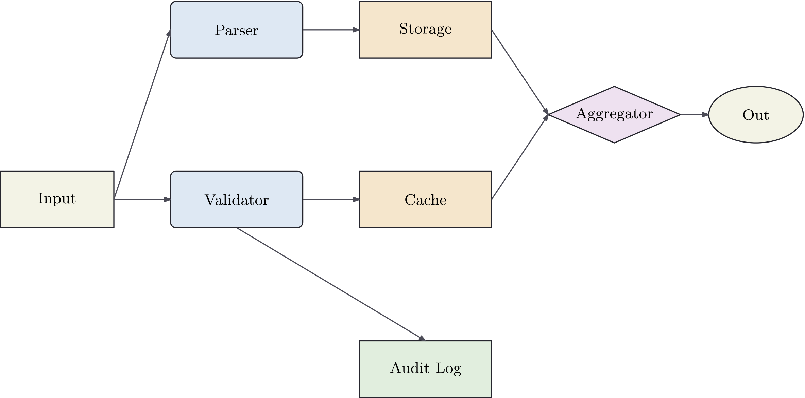
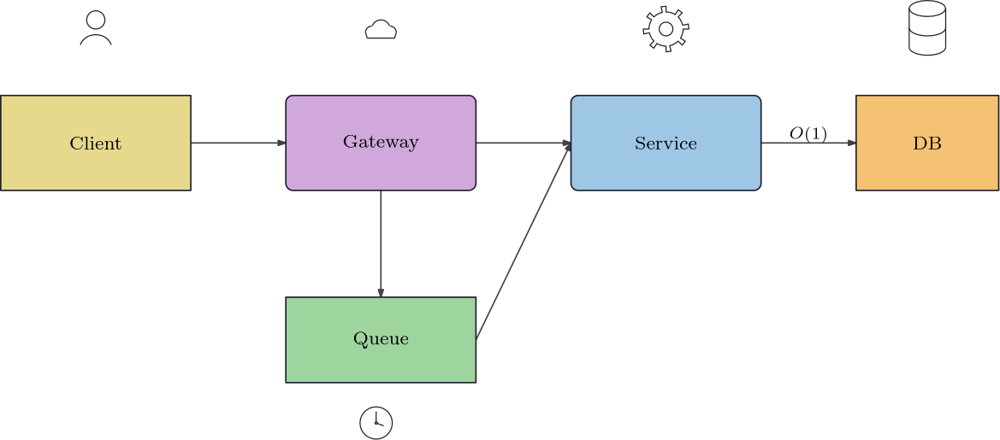

# ipe-bindcraft

Ipe automation skill + MCP server for AI coding agents. Create and iteratively edit native Ipe vector figures for academic papers via natural language — with transactional batches, stable object IDs, LaTeX-measured text, and native undo in the live GUI.

<p align="center">
  <a href="https://github.com/LHaiC/ipe-bandcraft/actions/workflows/ci.yml"></a>
  <a href="https://github.com/LHaiC/ipe-bandcraft/blob/master/LICENSE"></a>
  
  
</p>

<p align="center">
  
</p>
<p align="center"><em>Real pipeline output — 8-node system overview with semantic edges bound to node outlines, LaTeX-set labels, rendered by iperender (see tests/fixtures/)</em></p>

<p align="center">
  
</p>
<p align="center"><em>Curated icons grouped with nodes via <code>objects.group</code>, <code>auto</code>-routed semantic edges, LaTeX edge label, <code>paper-vivid</code> palette</em></p>

## Features

- **15 MCP tools** for document lifecycle, semantic editing, routing, layout, lint, preview, export
- **Two authoritative backends** — the `.ipe` file on disk, or a bound live Ipe window's in-memory document; never a second scene.json
- **Transactional batches** — typed operations with stable IDs, optimistic revision checks, request deduplication, atomic commits, and per-operation failure details
- **Semantic connections** — edges bind to real node outlines (rect / rounded / ellipse / diamond ports), auto re-route when endpoints move; `straight` / `orthogonal` / `auto` / `manual` routing, with **hop-over arcs** baked at edge crossings (the higher z-order edge jumps)
- **Academic presets** — semantic palettes (`paper-muted`, `paper-vivid`, `paper-ocean`, `paper-monochrome`), 3 starter templates (`system_overview`, `algorithm_pipeline`, `parallel_workers`), and 15 curated native-path icons (`database`, `cloud`, `gear`, …)
- **LaTeX-aware text** — labels are measured through real `ipescript` + `doc:runLatex()`; node resize never shrinks fonts
- **Native undo in Live mode** — every batch is a single `model:register` transaction (one Ctrl-Z), verified end-to-end
- **Preserve-everything editing** — unknown Ipe objects, human regrouping, and manual edits survive round-trips
- **Honest errors** — stable machine-readable codes (`REVISION_CONFLICT`, `LATEX_FAILED`, `GUI_BUSY`, `COMMIT_STATUS_UNKNOWN`, …) as `isError=true` tool results

## Requirements

- **Windows 10/11** (the live backend and `tests/windows_live` are Windows-only)
- **Ipe 7.2.x** — verified on 7.2.29 (winget `OtfriedCheong.Ipe`)
- **A local TeX** distribution for label measurement — verified on MiKTeX 26.2
- **Python 3.13** + [`uv`](https://docs.astral.sh/uv/)

## Installation

```bash
git clone https://github.com/LHaiC/ipe-bandcraft.git
cd ipe-bandcraft
uv sync --locked            # creates .venv with locked dependencies
```

For live (GUI) mode, install the bridge ipelet once per user:

```bash
.venv/Scripts/ipe-bindcraft.exe install-ipelet
```

This copies `ipelet/ipebindcraft.lua` into `%USERPROFILE%\Ipelets\`. It does
not touch any global Ipe or system configuration.

## MCP configuration

Any MCP-compatible agent can use the server over stdio:

```json
{
  "mcpServers": {
    "ipe-bindcraft": {
      "command": "C:\\path\\to\\ipe-bandcraft\\.venv\\Scripts\\python.exe",
      "args": ["-m", "ipe_bindcraft", "serve"]
    }
  }
}
```

## Quick start

```text
ipe-bindcraft doctor                  # probe Ipe/TeX/MCP + live bridge
ipe-bindcraft create fig.ipe --width 504 --height 300
ipe-bindcraft create fig.ipe --template algorithm_pipeline --palette paper-vivid
ipe-bindcraft status fig.ipe          # revision, objects, journal state
ipe-bindcraft apply fig.ipe ops.json --revision latest --request-id r1 \
    --lint --preview fig.png --annotate   # apply + lint + annotated PNG in one step
ipe-bindcraft inspect fig.ipe         # objects + API-space bboxes (default)
ipe-bindcraft lint fig.ipe --target-width 252
ipe-bindcraft polish fig.ipe fit_on_page wrap_texts --revision latest --request-id p1 --apply
ipe-bindcraft preview fig.ipe -o fig.png --annotate   # grid + object ids overlay
ipe-bindcraft export fig.ipe --formats pdf svg png -o out/
ipe-bindcraft open fig.ipe --backend live    # bound GUI session
ipe-bindcraft install-skill /path/to/consumer-repo   # install agent skill
ipe-bindcraft serve                          # stdio MCP server
```

`ops` payload forms: `@ops.json`, a bare `ops.json` path, `-` for stdin,
or an inline JSON array (a `{"ops": [...]}` wrapper also works). All
coordinates are API space: origin top-left, +x right, +y down, units bp —
`objects.translate` is a relative delta, `objects.move_to` and
`node.update`'s `changes.box` are absolute placement. Object ids are
greppable in the raw XML (`custom="ibc1:<id>:…"`).

Or just ask your agent: *"Create a system-overview figure in fig.ipe with 8
nodes, orthogonal edges, Nature-muted palette; export PDF + PNG."*

## Tools (15)

| Tool | Description |
|------|-------------|
| `doctor` | Probe Ipe/TeX/SDK and the live bridge |
| `create_document` / `open_document` / `save_document` / `close_document` | Session lifecycle (file or live backend) |
| `inspect_document` | Objects, geometry, edges, stale flags |
| `apply_operations` | Atomic typed batch: node/text/path/edge/icon create+update, translate, delete, group/ungroup, layer |
| `route_edges` | Re-route stale or selected edges |
| `layout_objects` | Align / distribute / grid |
| `lint_figure` / `polish_figure` | Overflow/overlap/off-page/edge-label checks + safe fixes (`fit_on_page`, `wrap_texts`, `grow_nodes_to_label`, …) |
| `render_preview` | PNG preview (image content; `PREVIEW_STALE` aware; `overlay` adds coord grid + ids) |
| `export_figure` | PDF/SVG/PNG generation directory + manifest |
| `get_request_status` / `list_presets` | Journal status / styles, palettes, templates, icons, TeX profiles |

## Request journal

Every `.ipe` has an append-only sibling `<file>.ibc-journal`. Each
mutating call needs a unique `--request-id`: a repeated id with the same
payload replays the stored result (idempotent retry); with a different
payload it fails as `REQUEST_ID_REUSED`; a `started`-but-never-`committed`
record surfaces `COMMIT_STATUS_UNKNOWN` instead of guessing.
`ipe-bindcraft status fig.ipe` shows the current revision and the last
journal state.

## Live mode

`open_document(path, backend="live")` launches `ipe.exe` bound to a private
session directory; the bundled ipelet applies each batch via
`ipe.Page` + `doc:set` inside one `model:register` transaction:

- one batch = **one native undo item** (Ctrl-Z / Ctrl-Y verified)
- manual edits in the GUI are authoritative — conflicting batches get
  `REVISION_CONFLICT` instead of overwriting
- GUI exit mid-request surfaces `COMMIT_STATUS_UNKNOWN`; never silently
  falls back to writing the file

## Architecture

```
AI Agent  <-- MCP stdio -->  ipe-bindcraft service
                                  │
                    ┌─────────────┴─────────────┐
                FileBackend                 LiveBackend
             (.ipe authoritative)      (bound GUI doc authoritative)
                    │                           │
              atomic write + lock    ipelet: ipe.Page + doc:set
                                    inside one model:register
```

One Python candidate compiler serves both backends — Lua only validates the
baseline and submits the candidate page; it contains no second router or
layout engine.

## Testing

```bash
pytest tests/unit            # no external deps
pytest tests/integration     # real Ipe + TeX (skips when absent)
pytest tests/windows_live    # real ipe.exe windows (Windows only)
```

82 unit tests + 6 integration tests pass on the target machine; see
`docs/acceptance-report.md` for the A01–A23 evidence matrix, and
`docs/capability-report.md` for the M0 probe results.

## Known limitations

- Ipe 7.2.29 CLI tools cannot open non-ASCII paths on zh-CN Windows;
  documents must live on ASCII paths (internal temp dirs are already
  ASCII-safe).
- Single page / single view documents only.
- Icons are a curated set of 15 native-path glyphs — arbitrary SVG icon
  import is intentionally out of scope. Hop-over arcs are generated for
  managed semantic edges only (manual edits to an edge's path are kept
  until its hop set changes). No arbitrary code execution — by design.

## Development

```bash
uv sync --locked --group dev
pytest tests -q
ipe-bindcraft schema > schemas/apply_operations.schema.json
```

## Credits

- [Ipe](https://ipe.otfried.org/) by Otfried Cheong — the extensible drawing editor this project automates
- [omnigraffle-bindcraft](https://github.com/Youn-17/omnigraffle-bindcraft) by Youn-17 — conceptual reference for batch operations, semantic connections, and the MCP + skill split
- [Model Context Protocol](https://modelcontextprotocol.io/) by Anthropic

## License

MIT — see `docs/third-party-notices.md` for dependency and tool notices.
